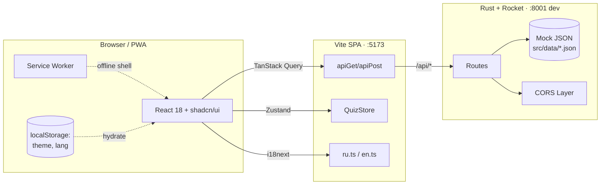
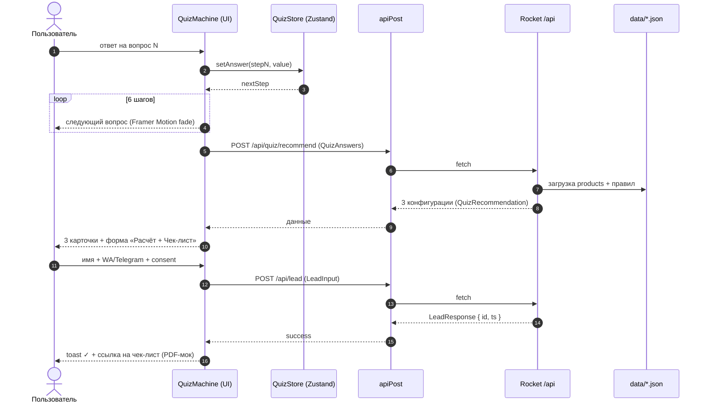
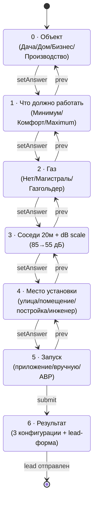
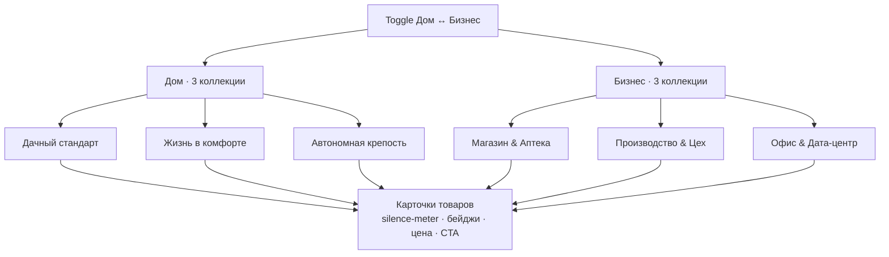

# Архитектура — Профи генераторы

## 1. Высокоуровневая диаграмма



## 2. Frontend стек и слои

| Слой              | Библиотеки / файлы                                                     |
| ----------------- | ---------------------------------------------------------------------- |
| Build             | Vite 5, vite-plugin-pwa, vite-plugin-react                              |
| UI                | React 18, shadcn/ui (Radix), Tailwind CSS, Framer Motion, lucide-react  |
| Routing           | react-router-dom v6 (`AppLayout` + `Outlet` + `ScrollRestoration`)      |
| Data fetching     | TanStack Query v5 (`useProducts`, `useQuizRecommend`, …)                |
| State             | Zustand (`QuizStore`), Context (`ThemeProvider`)                        |
| Forms             | React Hook Form + Zod (`LeadForm`)                                      |
| i18n              | react-i18next + i18next-browser-languagedetector (RU/EN)                |
| SEO               | react-helmet-async + JSON-LD (Org / LocalBusiness / FAQ / Review / Product) |
| Tests             | Vitest (unit, jsdom) + Playwright (e2e)                                 |

## 3. Структура папок

См. `frontend/README.md` и `backend/README.md`.

## 4. Поток данных «лид/квиз»



## 5. Машина состояний квиза



Реализация — `frontend/src/features/quiz/quiz-store.ts`. `QuizStep` — литеральный union `0 | 1 | … | 6`. `Math.min/max` приводятся к `QuizStep` через `as`.

## 6. Hero «свет ВКЛ/ВЫКЛ»

Слои:

1. Исходники PNG (без пережатия в JPEG): `hero-off.png`, `hero-on.png` в `frontend/public/images/hero/`.
2. `hero-background-canvas.tsx` — два `<canvas>` (cover-fit, `devicePixelRatio` до 2, `imageSmoothingQuality: high`).
3. Плавный кроссфейд по `opacity` (Framer Motion) между слоями при переключении резерва.
4. `reserve-switch.tsx` — тумблер «СЕТЬ / PROFI».

5. Тёплые радиальные блики (`mix-blend-soft-light`) при PROFI; рамка «генератора» в углу — подсветка и вибрация во время демо.

Поведение:

- Старт: дом в тёплом свете (PROFI). Через ~3,5 с (если нет `prefers-reduced-motion` и пользователь не трогал тумблер) запускается **сценарий блэкаута**.
- Блэкаут: полноэкранное затемнение (`createPortal`), колонка hero и шрифты гаснут; **блок резерва** остаётся на месте (fixed по координатам); в центре **обратный отсчёт 10…1**; хедер/футер приглушаются через `BlackoutDemoUiContext`.
- Через 10 с: свет в доме возвращается, оверлей исчезает, фаза `post_demo` — статус «Резерв активирован…», иконка **радиомачта** («Проверить сеть»), подсказка про переключение на «Сеть».
- Ручной запуск ссылки под блоком; любое взаимодействие с тумблером до авто-старта отменяет автодемо.
- Таймеры в `useEffect` с очисткой; при размонтировании Hero сбрасывается `setDimmingUi(false)`.

## 7. Бутик готовых решений



Источник данных — `backend/src/data/products.json` (~25+ моделей). Карточки используют AI-генерированные фото на отмостке/траве (`frontend/public/images/products/`).

## 8. Социальный капитал Кристовского — 5 точек

1. **Ribbon** под hero (`features/social-proof/kristovsky-ribbon.tsx`).
2. **Бейдж «★ Рекомендует Кристовский»** — флаг `recommendedByKristovsky` в `Product`, отображается в `product-card.tsx`.
3. **Featured-блок отзывов** — `features/testimonials/testimonials.tsx`, `featured: true` в `Testimonial`.
4. **Финальный экран квиза** — текстовый соц-пруф в `quiz-result.tsx`.
5. **About** — кейс-блок «Артисты в наших клиентах» (`pages/AboutPage.tsx`).

## 9. SEO / JSON-LD

Per-page meta + JSON-LD (`components/seo/meta.tsx`):

- **Все страницы** — Organization + LocalBusiness в layout.
- `/` — Product (3 топовых).
- `/faq` — FAQPage.
- About / homepage — Review (Кристовский, 5★).

`hreflang` — `ru-RU` / `en-US` через `<link rel="alternate">`.

## 10. PWA

- `vite-plugin-pwa` — autoUpdate, generateSW.
- Манифест: name, short_name, icons (192/512/maskable), theme_color (`#0A0E14`), background_color, display `standalone`.
- Service worker кэширует shell + локальные изображения; API не кэшируется (TanStack Query управляет своим кэшем).

## 11. Безопасность форм

- Все поля проходят через Zod-схемы (`features/lead/lead-form.tsx`).
- Маска телефона + чекбокс согласия (`/privacy`).
- Backend: `LeadInput.consent` обязателен; `cargo test` проверяет `lead_requires_consent`.

## 12. Производительность и утечки

- Все таймеры/интервалы — в `useEffect` с cleanup.
- `IntersectionObserver` в hero-fade-in освобождается в cleanup.
- `fetch`-вызовы — внутри TanStack Query (auto-abort при unmount).
- Аудио-моки в testimonials останавливаются (`pause()` + `currentTime = 0`) при unmount.
- `prefers-reduced-motion` уважается в hero и Framer Motion-блоках.

## 13. Деплой (рекомендуемая раскладка)

```
nginx/cdn → frontend/dist (статика, PWA)
            ↓ /api/* proxy
            └─→ Rocket release-бинарник (systemd / Docker)
```

Прод-замены:

- `Rocket.toml [release]` — `address = "0.0.0.0"`, `port = 8080`, `log_level = "warn"`. Локальная отладка — порт **8001** (см. `[default]`, чтобы не конфликтовать с другими сервисами на 8000).
- CORS — заменить `Allow-Origin: *` на whitelist домена.
- Vite `base` — оставить `/` (SPA на корне).
